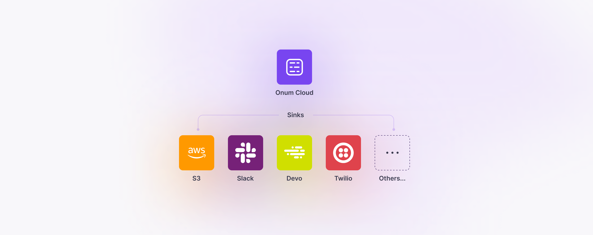
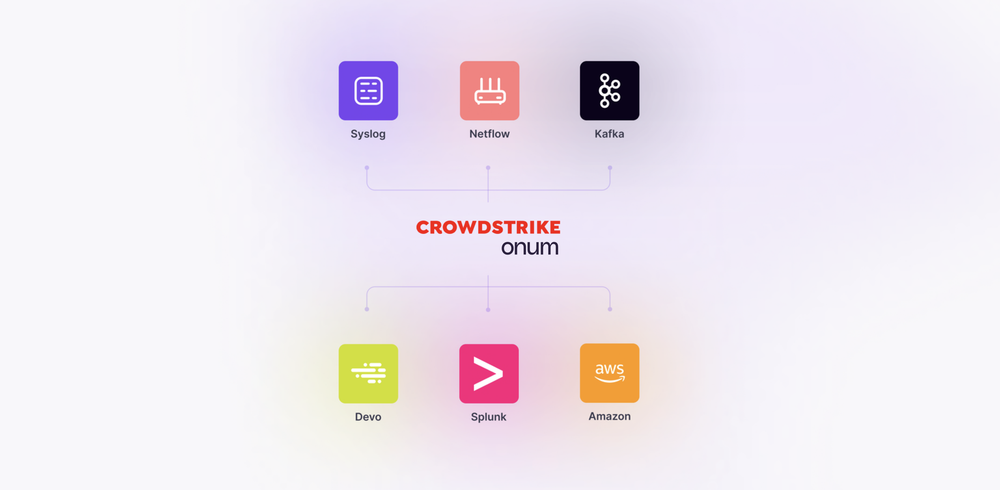

# 2-Architecture

Easy, flexible deployment in any environment while keeping them as close as possible to where the data is produced delivers unparalleled speed and efficiency, enabling you to cut the infrastructure you have dedicated to orchestration by up to 80%.

The Onum infrastructure consists of:

* **Distributor**: this is the service that hosts the Listener before forwarding it to Workers.
* **Worker**: this is the service that runs the Pipelines, receiving data from its Distributor and contained within a Cluster.
* **Cluster**: a container grouping Distributors and Workers. You can have as many clusters as required per Tenant.

Listeners are hosted within Distributors and are placed as close as possible to where data is generated. The Distributor pulls tasks from the data queue passing through the pipeline and distributes it to the next available worker in a Cluster. As soon as a Worker completes a task it becomes available again, and the Distributor in turn will assign it the next task from the queue.

The installation process creates the Distributor and all Workers for each data source in the cluster.

## How it works

<table data-view="cards"><thead><tr><th></th><th></th><th></th><th><select></select></th><th data-hidden data-card-cover data-type="files"></th></tr></thead><tbody><tr><td><strong>Any format. Any source.</strong></td><td>
Collect data from anywhere it’s generated, across every aspect of the network.

All data is aggregated, observed, and seamlessly routed to any destination.
</td><td></td><td></td><td><a href="../.gitbook/assets/any.png">any.png</a></td></tr><tr><td><strong>Edge observability</strong></td><td>Listeners are placed right on the edge to collect all data as close as possible to where it’s generated. </td><td></td><td></td><td><a href="../.gitbook/assets/edge.png">edge.png</a></td></tr><tr><td><strong>Centralized management</strong></td><td>Onum receives data from  Listeners and observes and optimizes the data from all nodes. All data is then sent to the proper data sink.</td><td></td><td></td><td><a href="../.gitbook/assets/centralized.png">centralized.png</a></td></tr></tbody></table>

## Deployment types

The Onum Platform supports any deployment type ― including `on-premises`, the Onum public cloud, or your own private `cloud`.

In a typical SaaS-based deployment, most processing activities are conducted in the Cloud.&#x20;

<figure><picture><source srcset="../.gitbook/assets/deployment-types-dark.png" media="(prefers-color-scheme: dark)"></picture><figcaption></figcaption></figure>

Client-side components can be deployed on a Linux machine or on a Kubernetes cluster for easy, flexible deployment in any environment. Onum supports all major cloud environments, including Amazon Web Services (AWS), Google Cloud Platform (GCP), and Microsoft Azure.

When the deployment type is on-premises, the communication between the management console and the process cluster will be encrypted with TLS and controlled by pull updates from the process cluster at configurable intervals.


Learn more about Deployment requirements [here](/broken/pages/goYTIe8jUZqClpgAG9Hw).


## Delivery methods

Onum supports all major standards such as Netflow, Syslog, and Kafka to orchestrate data streams to any desired destination, including popular data analytics tools such as Splunk and Devo, as well as storage environments such as S3.

<figure><picture><source srcset="../.gitbook/assets/croow.png" media="(prefers-color-scheme: dark)"></picture><figcaption></figcaption></figure>
