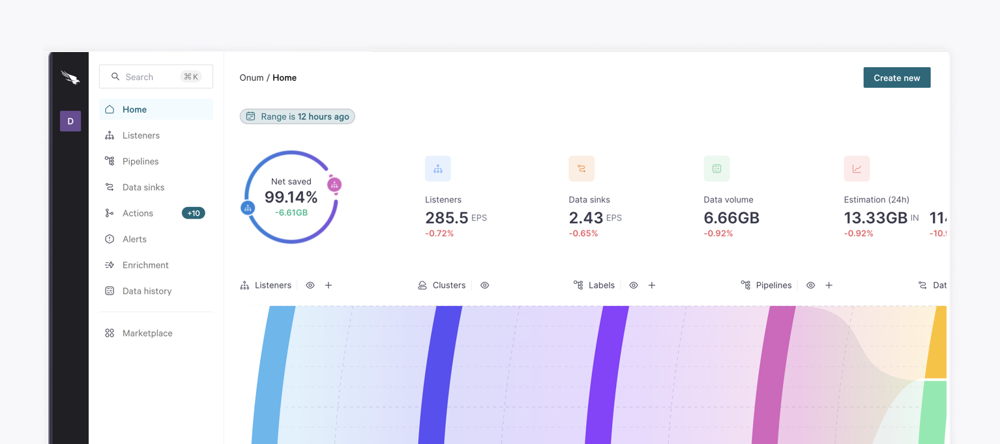

# 4-Getting Started with Falcon Onum

Welcome to Falcon Onum! This guide will help you start working with Onum, a powerful tool designed to enhance your data analysis and processing capabilities.



## Accessing Onum

Once you get your Onum credentials, you only have to go to [console.onum.com](https://console.onum.com/) and enter them to access your **Tenant**.&#x20;

A Tenant is a domain that contains a set of data in your organization. You can use one or various Tenants and grant access to as many as required. Learn more about working with Tenants [in this article](/broken/pages/2r5dcWmcccqZD9s5nYHd).

### Logging in

Once in [console.onum.com](https://console.onum.com/), there are several ways to log in:

* Log in with email address and password. Your password must be a minimum of 10 characters and include a combination of uppercase letters, lowercase letters, numbers, and symbols.
* Two-factor authentication
* Single Sign-On (SSO) with SAML
* Single Sign-On (SSO) with OpenID

Learn more about the different authentication types in [this section](/broken/pages/lMxtQAUznoDRId0Id5ph).


An inactive session will be automatically logged out after one hour.


## Navigating the interface

When you access the Onum app, you'll see [the **Home** page](/broken/pages/SbyNoKrssMewzexgs1og), where you can see an overview of the activity in your Tenant.

You can access the rest of the areas in Onum using the left panel.

<figure><picture><source srcset="../.gitbook/assets/daasa.png" media="(prefers-color-scheme: dark)"></picture><figcaption></figcaption></figure>

## Create your first Listener

Onum receives any data through **Listeners**.

These are logical entities created within a Distributor, acting as the gateway to the Onum system. Configuring a Listener involves defining an IP address, a listening port, and a transport layer protocol, along with additional settings depending on the type of Listener specialized in the data it will receive.

Access the **Listeners** area to start working with them. Learn how to create your first Listener [in this article](/broken/pages/GYyURyXe1A9niyvozKTO).

## Create your first Data Sink

Onum outputs data via **Data sinks**. Use them to define where and how to forward the results of your streamlined data.

Access the **Data sinks** area to start working with them. Learn how to create your first Data sink [in this article](/broken/pages/Mux29O4k4eugCz3t8QHo).

## Build your first Pipeline

Use **Pipelines** to start transforming your data and build a data flow. Pipelines are made of the following components:

* [Listeners](/broken/pages/GYyURyXe1A9niyvozKTO)
* [Actions](/broken/pages/Mnqa5EvZBdZ7hi7NLfZN)
* [Data sinks](/broken/pages/Mux29O4k4eugCz3t8QHo)

Learn more about Pipelines [in this section](/broken/pages/DYAGllTGDiM6UCbYQZw4).

### Use cases

Do you want to check the essential steps in Onum through specific Pipelines? Explore the most common use cases in [this section](https://app.gitbook.com/o/9sm794iTBacZSmhxRER6/s/lMswUMhL1LeEvusY1XNC/).

