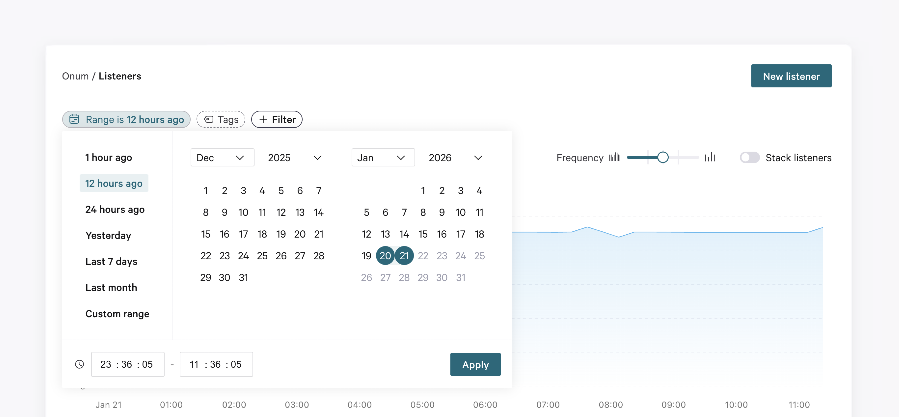

# 1-The Time Range Selector

## Overview

Throughout the entire Onum platform, you can set a period to either narrow down or extend the data shown. You can either select a predefined period or apply a custom time range.&#x20;

The related graph and resources will be automatically updated to display data from the chosen period. To remove a selected period, simply click the bin icon that appears next to the period to go back to the default time range (**1 hour ago**).&#x20;

<figure><picture><source srcset="../../.gitbook/assets/cccdark.png" media="(prefers-color-scheme: dark)"></picture><figcaption></figcaption></figure>


The intervals will be calculated according to the **Timezone** of your browser. Keep an eye out for future implementations, where you can manually select a timezone.


## Predefined and Custom time ranges

As well as predefined time intervals, you can also define a custom time range. To do it, simply select the required starting and ending dates in the calendar.

## Comparisons

The interesting thing about Onum is that you can directly see how much volume you have saved compared to past ingestions, telling you what is going well and what requires further streamlining.

The comparison is direct/equivalent, meaning all data shown is analyzed compared to the previously selected _equivalent_ time range.&#x20;

For example, if the time range is **1 hour**, the calculation of differences will be carried out using the _previous one hour_ before the current selection =

* Range selected: **10:00-11:00**
* Comparison: **09:00-10:00**&#x20;

Again, let´s say you now wish to view data over the last 7 days. The percentages will be calculated by measuring the volume retrospectively two weeks ago with the previous week.
