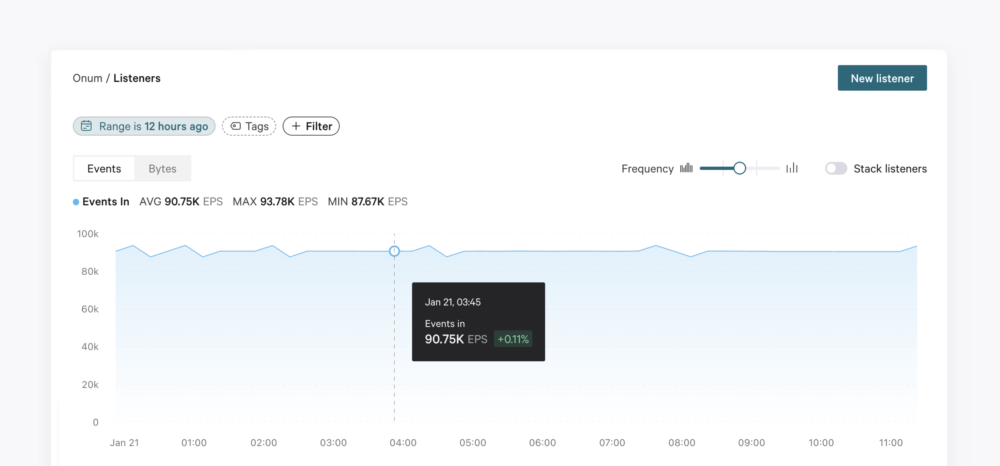

# 2-Graph Calculations

## Overview

This article outlines the more complex calculations that go on behind the graphs you see.

In the [Listeners](/broken/pages/GYyURyXe1A9niyvozKTO), [Pipelines](/broken/pages/DYAGllTGDiM6UCbYQZw4), and [Data sinks](/broken/pages/Mux29O4k4eugCz3t8QHo) views, you will see detailed metrics on your events and bytes in/out, represented in a graph at the top of these areas.

<figure><picture><source srcset="../../.gitbook/assets/ddds.png" media="(prefers-color-scheme: dark)"></picture><figcaption></figcaption></figure>

The line graph represents the events in/out, and the bar graph represents bytes in/on. Hover over a point on the chart to show a tooltip containing the events and bytes in for the selected time, as well as a percentage of how much increase/decrease has occurred since the previous lapse of time since the one currently selected.


The chart in the Pipelines area is slightly different and includes some additional features. Learn more in the [Pipelines](/broken/pages/DYAGllTGDiM6UCbYQZw4) section.


## Events vs Bytes

Use the **Events / Bytes** selector to choose which unit of measure you want to display in the graph. In both views, you will see the following data:

<table data-header-hidden><thead><tr><th width="186"></th><th></th></tr></thead><tbody><tr><td><strong>AVG</strong></td><td>The average events/bytes per second ingested or sent by <strong>all</strong> listeners/Data Sinks in your Tenant.</td></tr><tr><td><strong>MAX</strong></td><td>The maximum number of events/bytes per second ingested or sent by <strong>all</strong> Listeners/Data Sinks in your Tenant.</td></tr><tr><td><strong>MIN</strong></td><td>The minimum number of events/bytes per second ingested or sent by <strong>all</strong> Listeners/Data Sinks in your Tenant.</td></tr></tbody></table>

## Frequency slider and Stacked view

Use the **Frequency** slider bar to choose how frequently you want to plot the events/bytes in the chart. By default, these graphs give an overview calculation of all the Listeners/Sinks in your Tenants. If you wish to see each Listener or Sink individually, use the **Stack** toggle.
