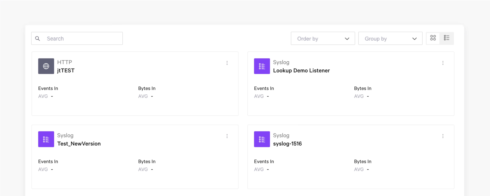
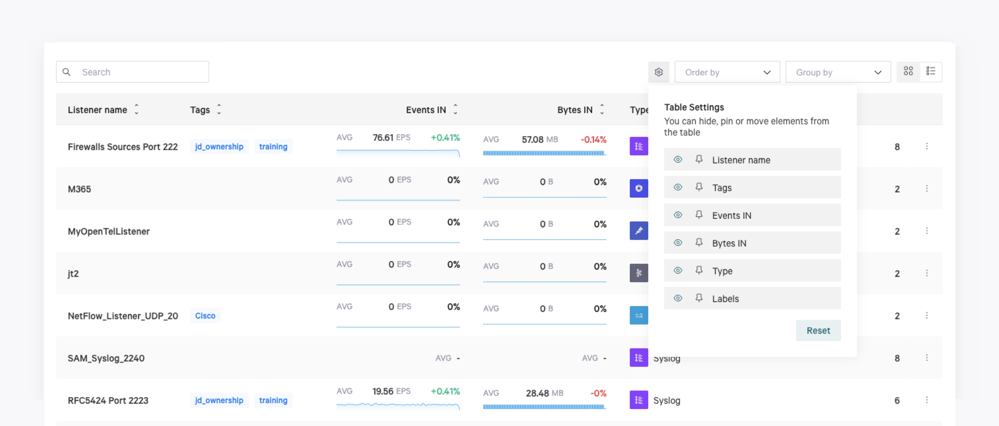

# 3-Cards and Table Views

## Overview

In the [Listeners](/broken/pages/GYyURyXe1A9niyvozKTO), [Pipelines](/broken/pages/DYAGllTGDiM6UCbYQZw4), [Data sinks](/broken/pages/Mux29O4k4eugCz3t8QHo) and [Enrichment](/broken/pages/NlFLbWNapAv37QIMkUAu) areas, you can view all the resources in your Tenant as cards or in a table. Use the icons at the top right corner of the elements to switch between both modes.

In both views, you can:

* Use the search box to look for specific elements in the list.
* Display all the elements individually in a list or grouped by types, and order the elements as required. These grouping options vary depending on the area you are.

## Cards view

In this view, each element is displayed as a card that shows details about it.

* Click a card to open the details window, or double-click it to access the element and edit it. In the details window, you can click the **Add tag** button and add the required tags to an element. For each tag you enter in the box, hit the `Enter` key. Click **Save** to add the tags.
* Click the ellipsis button on each card to edit the element, copy its ID, or remove it.

<figure><picture><source srcset="../../.gitbook/assets/lñala.png" media="(prefers-color-scheme: dark)"></picture><figcaption></figcaption></figure>

## Table view

In the **Table** view, you can click the cog icon to begin customizing the table settings. You can reorder the columns in the table, hide or display the required ones or pin them.

Changes will be automatically applied. Click the **Reset** button to recover the original configuration.

<figure><picture><source srcset="../../.gitbook/assets/iiitt.png" media="(prefers-color-scheme: dark)"></picture><figcaption></figcaption></figure>

* Click a row to open the details window, or double-click it to access the element and edit it. In the details window, you can cick the **Add tag** button and add the required tags to an element. For each tag you enter in the box, hit the `Enter` key. Click **Save** to add the tags.
* Click the icon next to each column name to sort the table content or pin columns.
* Click the ellipsis button on each row to edit the element, copy its ID, or remove it.

## Order and group elements

In both cards and table views, you can display your elements using the following options:

* **Order by** - Order the elements by a specific criterion (alphabetically, creation date or update date).
* **Group by** - Group the elements in different categories. The categories you can choose may vary in each area of the platform (status, type, etc).&#x20;
