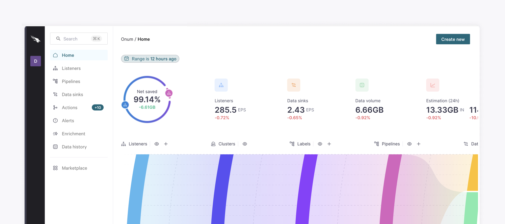
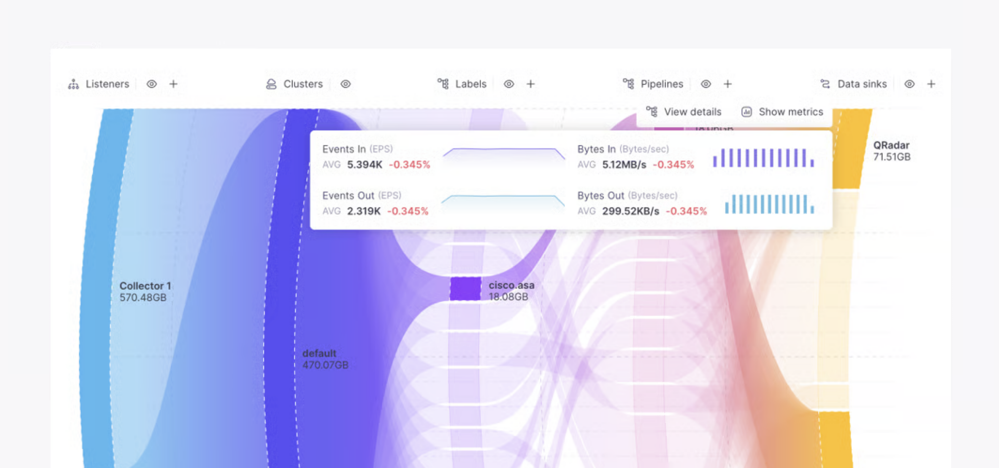

# 1-Home



## Overview

When opening Onum, the **Home** area is the default view. Here you can see an overview of all the activity in your [Tenant](/broken/pages/2r5dcWmcccqZD9s5nYHd).

<figure><picture><source srcset="../.gitbook/assets/sannnn genel.png" media="(prefers-color-scheme: dark)"></picture><figcaption></figcaption></figure>

Use this view to analyze the flow of data and the change from stage to stage of the process. Here you can locate the most important contributions to your workflow at a glance.&#x20;


All data shown is analyzed compared to the previously selected time range. Use the time range selector at the top of this area to specify the periods to examine.

For example, if the time range were **1 hour ago** (the default period), the calculation of differences will be carried out using the previous **one hour** before the current selection:

* Range selected: **10:00-11:00**
* Comparison: **09:00-10:00**&#x20;

To learn more about time ranges, go to [Selecting a Time Range.](/broken/pages/Ffzy8DEy77jdr2yY5FE4)


## Metrics

The **Home** view shows various infographics that provide insights into your data flow. Some Listeners or Data Sinks may be excluded from these metrics if they are duplicates or reused.


The **Net Saved/Increased** and **Estimation** graphs will show an info tooltip if some [Data sinks](/broken/pages/Mux29O4k4eugCz3t8QHo) are excluded from these metrics. You may decide this during the Data sink creation.

In those cases, you can hover over the icon to check the total metrics including all the Data sinks.


<table data-card-size="large" data-view="cards"><thead><tr><th></th><th></th><th></th><th data-hidden data-card-cover data-type="image">Cover image</th><th data-hidden data-card-cover-dark data-type="image">Cover image (dark)</th></tr></thead><tbody><tr><td><strong>Net Saved/Increased</strong></td><td>Here you can see the difference (in %) of volume <em>saved/increased</em> in comparison to the previous period. Hover the circle icons to see the input/output volumes and see the total GB saved.</td><td></td><td><a href="../.gitbook/assets/grrd.png">grrd.png</a></td><td><a href="../.gitbook/assets/blllaas.png">blllaas.png</a></td></tr><tr><td><strong>Listeners</strong></td><td>View the total amount of data ingested by the Listeners in the selected time range compared to the previous, as well as the increased/decreased volume (in %).</td><td></td><td><a href="../.gitbook/assets/llls.png">llls.png</a></td><td><a href="../.gitbook/assets/lissstete.png">lissstete.png</a></td></tr><tr><td><strong>Data sinks</strong></td><td>You can see at a glance the total amount of data sent out of your Tenant, as well as the difference (in %) with the previous time range selected.</td><td></td><td><a href="../.gitbook/assets/ddss1.png">ddss1.png</a></td><td><a href="../.gitbook/assets/dddaaa.png">dddaaa.png</a></td></tr><tr><td><strong>Data volume</strong></td><td>This shows the total volume of ingested data for the selected period. Notice it is the same as the input volume shown in the Net saved/increased metric. You can also see the difference (in %) with the previous time range selected.</td><td></td><td><a href="../.gitbook/assets/vvol.png">vvol.png</a></td><td><a href="../.gitbook/assets/volvol.png">volvol.png</a></td></tr><tr><td><strong>Estimation</strong></td><td>The estimated volumes ingested and sent over the next 24 hours. This is calculated using the data volume of the time period.</td><td></td><td><a href="../.gitbook/assets/essst.png">essst.png</a></td><td><a href="../.gitbook/assets/essste.png">essste.png</a></td></tr></tbody></table>

## Sankey diagram

Each column of the Sankey diagram provides information and metrics on the key steps of your flow.&#x20;

<figure><picture><source srcset="../.gitbook/assets/dddjajaja.png" media="(prefers-color-scheme: dark)"></picture><figcaption></figcaption></figure>

You can see how the data flows between:

1. [Listeners](/broken/pages/GYyURyXe1A9niyvozKTO) - each Listener in your Tenant.
2. [Clusters](/broken/pages/sYjOapXSEqD9Ia9fNrDR) - the Distributor/Worker group receives the Listener data and forwards it to Pipeline.
3. [Labels](/broken/pages/ILfUyucfSPH2L391qxuW) - the operations and criteria used to filter out the data to be sent on to Pipelines.
4. [Pipelines](/broken/pages/DYAGllTGDiM6UCbYQZw4) - the Pipelines used to obtain desired data and results.
5. [Data sinks](/broken/pages/Mux29O4k4eugCz3t8QHo) - the end destination for data having passed through **Listener › Cluster › Label › Pipeline**.

Hover over a part of the diagram to see specific savings.

### Show metrics

You can narrow down your analysis even further by selecting a specific node and selecting **Show metrics**.


This option is not available for all columns.


### **View details**&#x20;

Click a node and select **View details** to open a panel with in-depth details of the selected piece.

From here, you can go on to edit the selected element.


This option is not available for all columns.


### Hide/show columns

You can choose which columns to view or hide using the eye icon next to its name.

### Add new elements

You can add a new **Listener**, **Label**, **Pipeline** or **Data sink** using the plus button next to its name. You can also create all of the aforementioned elements using the **Create new** button at the top-right:
