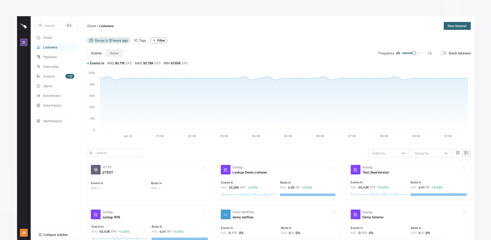

# 2-Listeners



## Overview

Essentially, Onum receives any data through **Listeners**. These are logical entities created within a [Distributor](/broken/pages/sYjOapXSEqD9Ia9fNrDR), acting as the gateway to the Onum system. Due to this, configuring a Listener involves defining an IP address, a listening port, and a transport layer protocol, along with additional settings depending on the type of Listener specialized in the data it will receive.&#x20;

A **Push** type of Listener passively sources data without explicitly requesting, whereas a **Pull** type is where the user actively requests data from an external source.&#x20;


If you are using more than one **Cluster**, it is recommended not to use a **Pull-type** Listener. You can find out the Listener type in the integration-specific articles below.



**Cloud Listeners**

When configuring a Listener in a Cloud tenant, note that the selected port must fall within the range of **1024 to 10000**. Learn more about Cloud Listeners in [this article](/broken/pages/ZBvczE2SSU071bnFXVaH).


Click the **Listeners** tab on the left menu for a general overview of the Listeners configured in your Tenant and the events generated.

<figure><picture><source srcset="../.gitbook/assets/lllllb.png" media="(prefers-color-scheme: dark)"></picture><figcaption></figcaption></figure>

* The blue graph represents the events in. Use the buttons above the graph to switch between **Events**/**Bytes**, and the **Frequency** slider bar to choose how frequently you want to plot the events/bytes in the chart. Use the **Stack Listeners** toggle to view each individual Listener on your graph and its metrics. Learn more about this graph [in this article](/broken/pages/Cpi5yLyDONU9vuISuUnw).&#x20;
* Hover over a point on the chart to show a tooltip containing the events/bytes coming in for the selected time, as well as a percentage of how much increase/decrease has occurred between the previous lapse of time and the one currently selected.

At the bottom, you have a list of all the Listeners in your Tenant. You can switch between the **Cards** view, which shows each Listener in a card, and the **Table** view, which displays Listeners listed in a table. Learn more about the cards and table views [in this article](/broken/pages/TepBA51V9byyFmkaofix).

## Narrow Down Your Data

There are various ways to narrow down what you see in this view:

### **Add Filters**

Add filters to narrow down the Listeners you see in the list. Click the **+ Filter** button and select the required filter type(s). You can filter by:

* **Name** - Select a **Condition** (**Contains**, **Equals**, or **Matches**) and a **Value** to filter Listeners by their names.
* **Version** - Filter Listeners by their version. Choose a **Condition** and a **Value** to filter by.
* **Type** - Choose the Listener type(s) you want to see in the list.
* **Created by** - Selecting this option opens a users dropdown where you can filter by creator.
* **Updated by** - Selecting this option opens a users dropdown where you can filter by the last user to update a pipeline.

The filters applied will appear as tags at the top of the view.


Note that you can only add one filter of each type.


### **Select a Time Range**

If you wish to see data for a specific time period, this is the place to click. Go to [this article](/broken/pages/Ffzy8DEy77jdr2yY5FE4) to dive into the specifics of how the time range works.

### **Select Tags**

You can choose to view only those Listeners that have been assigned the desired tags. You can create these tags in the Listener settings or from the cards view. Press the `Enter` key to confirm the tag, then **Save**.

To filter by tags, click the **Tags** button, select the required tag(s) and click **Save**.

## Create a Listener

Depending on your permissions, you can create a new Listener from this view. There are several ways to create a new Listener:

* From the **Listeners** view, clicking the **New listener** button.
* From[ the Home page](/broken/pages/SbyNoKrssMewzexgs1og), clicking **Create new > Listener** or clicking the **+** button in the **Listeners** column of the Sankey diagram.
* Hover over the **Listeners** section in the left pane and click the **Create listener** button that appears in the search window.
* Within a [Pipeline](/broken/pages/DYAGllTGDiM6UCbYQZw4).

Configuring your Listener involves various steps:



#### Choose your Listener type

The first step is to define the Listener **Type**. Select the desired type in this window and select **Configuration**, or double-click it.&#x20;

Check the list of available Listener types in [this article](/broken/pages/65xcwjCPvsj5MZq9alGt).



#### Configure your Listener

The configuration is different for each Listener type. Check the different Listener types and how to configure them [in this section](/broken/pages/65xcwjCPvsj5MZq9alGt).


If your Listener is deployed in the Cloud, you will see an extra step for the network properties. Learn more about Listeners in a Cloud deployment [in this article](/broken/pages/ZBvczE2SSU071bnFXVaH).




#### Add Labels

Use Onum's labels to cut out the noise with filters and search criteria based on specific metadata. This way, you can categorize events sent on and processed in your [Pipelines](/broken/pages/DYAGllTGDiM6UCbYQZw4).

Learn more about labels [in this article](/broken/pages/ILfUyucfSPH2L391qxuW).



## Edit a Listener

You can edit an existing Listener by double-clicking it in the Listeners view. You'll be directly taken to its configuration form, where you can edit any required values.

Alternatively, click the ellipses in the card or table view in the **Listeners** area and select **Edit**, or click a Listener to access its details view and select **Edit listener**.
