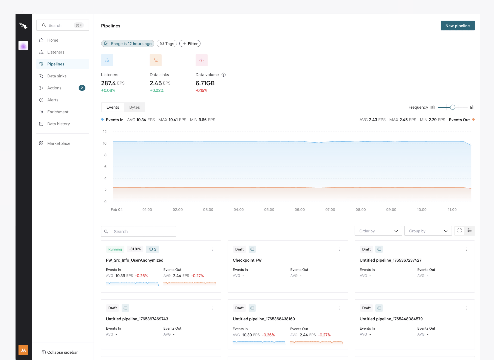

# 3-Pipelines



## Overview

Use **Pipelines** to transform your events and build a data flow linking [Actions](/broken/pages/Mnqa5EvZBdZ7hi7NLfZN) from [Listeners](/broken/pages/GYyURyXe1A9niyvozKTO) and to [Data sinks](/broken/pages/Mux29O4k4eugCz3t8QHo).

Select the **Pipelines** tab at the left menu to visualize all your Pipelines in one place. Here's what you will find all the actions you can perform in this area:

<figure><picture><source srcset="../.gitbook/assets/ppppb.png" media="(prefers-color-scheme: dark)"></picture><figcaption></figcaption></figure>

* The graph at the top plots the data volume going through your Pipelines. The blue graph represents the data in, and the orange one represents the data going out. Use the buttons above the graph to switch between **Events**/**Bytes**, and the **Frequency** slider bar to choose how frequently you want to plot the events/bytes in the chart.
* At the bottom, you will find a list of all the Pipelines in your tenant. You can switch between the **Cards** view, which shows each Pipeline in a card, and the **Table** view, which displays Pipelines listed in a table. Learn more about the cards and table views [in this article](/broken/pages/TepBA51V9byyFmkaofix).

## Narrow Down Your Data

There are various ways to narrow down what you see in this view, both the Pipeline list and the informative graphs. To do it, use the options at the top of this view:

### **Add Filters**

Add filters to narrow down the Pipelines you see in the list. Click the **+ Filter** button and select the required filter type(s). You can filter by:

* **Name** - Select a **Condition** (**Contains**, **Equals**, or **Matches**) and a **Value** to filter Pipelines by their names.&#x20;
* **Status** - Choose the status(es) you want to filter by: **Draft**, **Running**, and/or **Stopped**. You'll only see Pipelines with the selected status(es).
* **Created by** - Filter for the creator of the Pipeline in the window that appears.
* **Updated by** - Filter for users to see the Pipeline they last updated.

The filters applied will appear as tags at the top of the view.


Note that you can only add one filter of each type.


### **Select a Time Range**

If you wish to see data for a specific time period, this is the place to click. Go to [Selecting a Time Range](/broken/pages/4Z3TFv3t7fJmUZYeA2E4) to dive into the specifics of how the time range works.

### **Select Tags**

You can choose to view only those Pipelines that have been assigned the desired tags. You can create these tags in the Pipeline settings or from the cards view. Press the `Enter` key to confirm the tag, then **Save**.

To filter by tags, click the **Tags** button and select the required tag(s).

## Metrics

Below the filters, you will see 3 metrics informing you about various components in your Pipelines.


Note that these metrics are affected by the [time range](/broken/pages/Ffzy8DEy77jdr2yY5FE4) selected.


Listeners

View the events per second (EPS) ingested by all Listeners in your Pipelines for the selected time range, as well as the difference in percentage compared to the previous lapse.

Data sinks

View the events per second (EPS) sent by all Data Sinks in your Pipelines for the selected time range, as well as the difference in percentage compared to the previous.

Data volume

See the overall data volume processed by all Pipelines for the selected time range, and the difference in percentage with the previous.

## Visualize Your Data In/Out

Select **Events** or **Bytes** to see the volume received/sent by your **Pipelines** for the selected time range. Incoming events are represented in blue, and outcoming events are shown in orange.

Hover over a point on the chart to show a tooltip containing the events and bytes in/out for the selected time, as well as a percentage of how much increase/decrease has occurred since the previous lapse of time since the one currently selected.

You can also analyze a different time range directly on the graph. To do it, click a starting date in the map and drag the frame that appears until the required ending date. The time range above will be also updated.

## Pipelines List

At the bottom, you have a list of all the Pipelines in your tenant.&#x20;

Use the **Group by** drop-down menu at the right area to select a criterion to organize your Pipelines in different groups (**Status** or **None**). You can also use the search icon to look for specific Pipelines by name.

Use the bottoms at the left of this area to display the Pipelines as **Cards** or listed in a **Table**:

Cards view

In this view, Pipelines are displayed as cards that display useful information. Click a card to open the Pipeline detail view, or double-click it to access it.&#x20;

This is the information you can check on each card:

* You can see the status of the Pipeline at the top left corner (**Running**, **Draft**, or **Stopped**).
* The percentage nect to the status indicates the amount of data that goes out of the Pipeline compared to the total incoming events, so you can check how data is optimized at a glance. Hover over it to see the in/out data in bytes and the estimation over the next 24 hours.
* Click the **tag** button to define tags for the Pipeline. To assign a new tag, simply type the name you wish to assign, make sure to press `Enter`, and then select the **Save** button. If the Pipeline has tags defined already, you'll see the number of tags next to the tag icon.
* Click the ellipses in the right-hand corner of the card to reveal the options to **Edit**, **Copy ID**, **Duplicate**, or **Remove** it.

Table view

In this view, Pipelines are displayed in a table, where each row represents a Pipeline. Click a row to open the Pipeline detail view, or double-click it to access it.

Click the cog icon at the top left corner to rearrange the column order, hide columns, or pin them. You can click **Reset** to recover the default configuration.

Learn more about the cards and table views [in this article](https://docs.onum.com/getting-started/understanding-the-essentials/cards-and-table-views).

## Pipeline detail view

Click a Pipeline to open its settings in the right-hand pane. Here you can see [Pipeline versions](/broken/pages/SLvTuhkViXBSA0unJAEw) and edit the Pipeline. Click the ellipses in the top right to **Copy ID** or **Duplicate** / **Remove** it.

The details pane is split into three tabs showing the Pipeline at different statuses:

<table><thead><tr><th width="170.2734375">Tab</th><th>Description</th></tr></thead><tbody><tr><td><strong>Running</strong></td><td>This is the main tab, where you can see details of the Pipeline versions that are currently running. Select the drop-down next to the Pipeline version name to see which clusters the Pipeline is currently running in.</td></tr><tr><td><strong>Draft</strong></td><td>Check the details of the draft versions of your Pipeline.</td></tr><tr><td><strong>Stopped</strong></td><td>Check the details of the version of your Pipeline that are currently stopped.</td></tr></tbody></table>

Once you have located the Pipeline to work with, click **Edit Pipeline** to open it.

## Create a Pipeline

Depending on your permissions, you can create a new Pipeline from this view. There are several ways to create a new Pipeline:

* From the **Pipelines** view, clicking the **New pipeline** button.
* From[ the Home page](https://docs.onum.com/the-workspace/home), clicking **Create new > Pipeline** or clicking the **+** button in the **Pipelines** column of the Sankey diagram.
* Hover over the **Pipelines** section in the left pane and click the **Create pipeline** button that appears in the search window.

Give your Pipeline a name and add optional tags to identify it. See [Building a Pipeline](/broken/pages/1NusCz0tjpIKHxcRySI1) to learn how to build your Pipeline step by step.
